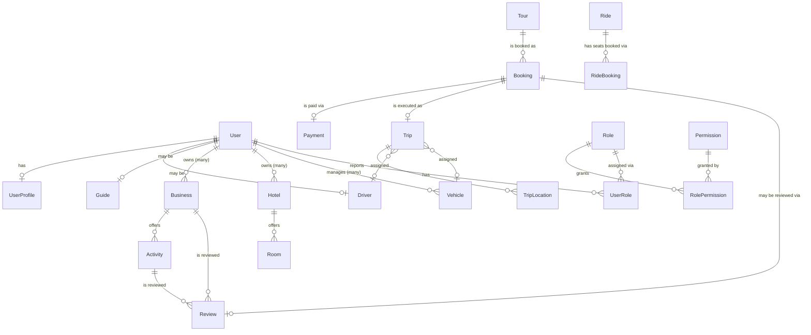

# Entity Relationships

Every relationship crossing a service boundary below is a **plain UUID
column, not a real foreign key** -- Postgres can't enforce a constraint
across schemas owned by different services, and even within one service
schema, cross-service references are deliberately just UUIDs validated (or
not) via a REST call at write time. Real FK constraints only exist for
relationships *within* a single service's schema (e.g., `Room.hotel_id ->
Hotel.id`, both in `catalog_service`).

## Cross-service reference map

| From (service) | Column | To (service) | Verified how |
|---|---|---|---|
| booking-service.Booking | `tour_id` | catalog-service.Tour | `TourClient` call at booking creation (fetches real price) |
| payment-service.Payment | `booking_id` | booking-service.Booking | `BookingClient` call at payment creation (fetches real amount, verifies ownership) |
| mobility-service.Trip | `booking_id` | booking-service.Booking | `BookingClient` call at trip creation (verifies booking exists + ownership) |
| engagement-service.Review | `booking_id` | booking-service.Booking | `BookingClient` call (verifies booking is `COMPLETED` + ownership) |
| engagement-service.Review | `business_id`, `activity_id` | catalog-service.Business/Activity | `BusinessClient` calls (verifies business exists, activity belongs to it) |
| engagement-service.Review | -- | booking.tour_id / activity | **Not verified.** There's no established relationship between catalog-service's `Tour` and catalog-service's `Activity` -- they're parallel concepts from separate build sessions. Deliberately not faked; see engagement-service's `ReviewService.createReview` comment. |
| catalog-service.Activity | `business_id` | (same schema) catalog-service.Business | Real FK constraint (`fk_activities_business`) |
| catalog-service.Room | `hotel_id` | (same schema) catalog-service.Hotel | Real FK constraint (`fk_rooms_hotel`) |
| mobility-service.RideBooking | `ride_id` | (same schema) mobility-service.Ride | Real FK constraint (`fk_ride_bookings_ride`) |
| mobility-service.TripLocation | `trip_id` | (same schema) mobility-service.Trip | **Not verified** -- no ownership check on write (scoped-down v1, see `SERVICE-BOUNDARIES.md`) |
| mobility-service.Trip | `driver_id` | (same schema) mobility-service.Driver | **Not verified** -- assigned by ID reference only, no existence check |
| mobility-service.Trip | `vehicle_id` | (same schema) mobility-service.Vehicle | **Not verified** -- same as above |
| identity-service.UserRole | `user_id` | (same schema) identity-service.User | Not verified -- any UUID accepted, no existence check |
| mobility-service.Driver | `user_id` | identity-service.User | Not verified at write time, but is the JWT's own subject (self-registration) |

The "not verified" rows are honest gaps, not oversights papered over. Three
of them (`TripLocation`/`Trip`/`Vehicle`/`Driver`, `UserRole`/`User`) became
same-schema references as a side effect of the 2026-09-06 service
consolidation (`ADR-002-SERVICE-CONSOLIDATION.md`) -- they're now a real FK
constraint away from being verified, not a cross-service integration
project. They're left unverified here deliberately: fixing them wasn't part
of that consolidation's scope, and adding FK constraints or ownership
checks as a side effect of an unrelated merge would blur what actually
changed. The remaining gaps genuinely do need cross-service work: identity-
service's `User` is a different service from mobility-service's `Driver`,
so verifying `Driver.user_id` at write time would need an `IdentityClient`
mobility-service doesn't have yet.

## Why no cross-schema foreign keys

Per `SERVICE-BOUNDARIES.md` and the project's core rule: a service must
never directly access another service's database, so a real FK across
schema boundaries would violate that even though Postgres technically
permits cross-schema FKs within one database. Consistency (an orphaned
`booking_id` in `payment_service.payments` after a hypothetical hard-delete
in `booking_service.bookings`) is accepted as the tradeoff for service
independence -- and mitigated in practice by nothing in this codebase ever
hard-deleting a referenced entity; see "Soft delete" in
`DATABASE-DESIGN.md`.
